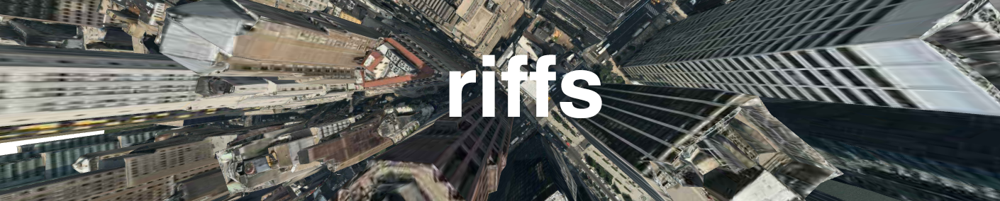

#### [Live Demo](http://miketahani.github.com/HERE-riffs/index.html?city=nyc&style=3d-photo#18/40.70568/-74.00958)
(Note: this is a slippy map with click-drag panning and double-click zooming functionality)

### Motivation

During my time at Stamen, I [worked](http://content.stamen.com/here.stamen.com_technical) on the [here.stamen.com](http://here.stamen.com) 3D slippy-map project hoping that people would use it for inspiration and use the code in their own projects. In the spirit of openness, our fearless leader Eric Rodenbeck [wrote](http://content.stamen.com/here.stamen.com)

> We built a framework sitting on top of [Nokia's data] that lets this data be embedded, linked to, layered on top of, and generally made internet-happy in a way that we hope will let a thousand flowers bloom.

and

> In the meantime we're starting on a round of design work that uses these in-browser  3D maps as the basis for what we hope will be a whole new suite of consumer applications and projects. For now we encourage you to poke around under the hood and think about doing the same.

In that same spirit, I'm putting up a version of the framework that can be run locally and played with. All of the framework code in this repo is publicly available on the Stamen HERE site; I just copy/pasted it and mobilized it. 

This is an ongoing effort to minimize the code down to barebones essentials and experiment with the data. Let me know if you have any questions or want to share something cool. 

### Riffs (so far)

1. [Anaglyph-Parallax](http://miketahani.github.com/HERE-riffs/anaglyph-parallax.html?city=nyc&style=3d-photo#18/40.70568/-74.00958)
2. [Snap-Camera](http://miketahani.github.com/HERE-riffs/snap-camera.html?city=nyc&style=3d-photo#18/40.70568/-74.00958)

### Use

You'll need to append a querystring with the map parameters to the URL the first time you hit the page. For example,

`http://localhost:3000/index.html?city=nyc&style=3d-photo#18/40.70568/-74.00958`

### Disclaimer

This is important. 

The entirety of the original code base belongs to Stamen/Nokia and the data belongs to Nokia. The changes to the original code that now constitute this repo are in no way affiliated with or sanctioned by Stamen or Nokia, nor should they reflect on the incredible quality of those companies' work. In the spirit of openness that drove the original project, I'm just making it easier to play with in the hope that people will do beautiful things with it.
